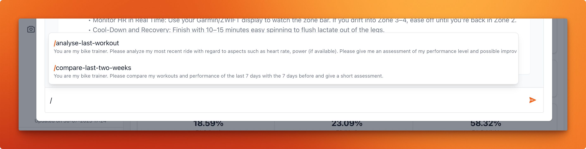

# AI integration

To start using the AI features in **Statistics for Strava**, you first need to properly configure the integration.

> [!WARNING]
> **Warning** Use caution when enabling this feature if your app is publicly accessible

> [!IMPORTANT]
> **Important** Statistics for Strava uses the <a href="https://docs.neuron-ai.dev">Neuron AI</a> library to interface with AI models.
> Only providers supported by Neuron AI are compatible. See the full list of <a href="https://docs.neuron-ai.dev/components/ai-provider">supported providers</a>

## Cloud providers

To use a cloud-based AI provider, you will need:

* An API key
* The name of the model you want to use

Once you have this information, update your `config.yaml` file:

```yaml
integrations:
  ai:
    enabled: true
    enableUI: false
    provider: 'PROVIDER-YOU-CHOOSE'
    configuration:
      key: 'YOUR-API-KEY'
      model: 'MODEL-NAME'
```

## Locally hosted Ollama

You can also run a local model using Ollama. Start by configuring a Docker container for Ollama:

```yaml
services:
    ollama:
        image: ollama/ollama:latest
        container_name: 'statistics-for-strava-ollama'
        tty: true
        restart: unless-stopped
        volumes:
            - .:/code
            - ./ollama:/root/.ollama
        environment:
            - OLLAMA_KEEP_ALIVE=24h
            - OLLAMA_HOST=0.0.0.0
        ports:
            - '11434:11434'
        networks:
            - statistics-for-strava-network
```

> [!TIP]
> **Tip**  Looking for more advanced setups?
> Check out this <a href="https://github.com/mythrantic/ollama-docker">Ollama Docker GitHub repository</a>.

Next, download the model you want to use. For example, to run `llama3.2`:

```bash
> docker compose exec ollama ollama pull llama3.2
```

Finally, configure the AI integration in your `config.yaml` file:

```yaml
integrations:
  ai:
    enabled: true
    provider: 'ollama'
    configuration:
      url: 'http://host.docker.internal:11434/api'
      model: 'MODEL-NAME'
```

> [!IMPORTANT]
> **Important** Make sure you're running the latest version of Ollama. Streaming responses with tooling has been <a href="https://ollama.com/blog/streaming-tool">added on May 28, 2025.</a>

## OpenRouter

[OpenRouter](https://openrouter.ai) provides access to hundreds of models (OpenAI, Anthropic, Google and more) through a single API key, including free-tier models. This makes it easy to get started or test different models.

To use OpenRouter, configure the `openAILike` provider in your `config.yaml`:

```yaml
integrations:
  ai:
    enabled: true
    enableUI: true
    provider: 'openAILike'
    configuration:
      baseUri: 'https://openrouter.ai/api/v1'
      key: 'YOUR-OPENROUTER-API-KEY'
      model: 'anthropic/claude-sonnet-4.5'  # See openrouter.ai/models for all available models
```

> [!TIP]
> OpenRouter offers [free models](https://openrouter.ai/collections/free) which are great for testing without any cost.

## Your AI workout assistant

The first available AI feature is an AI-powered workout assistant named **Mark**.

### Via the CLI

```bash
> docker compose exec app bin/console app:ai:agent-chat
```

This will prompt you with a message like the following:

 

### Via the UI

[Virtual AI assistant](https://www.youtube.com/embed/mdidBVigJAo ':include :type=iframe width=100% height=400px title="Statistics for Strava" frameborder="0" allow="accelerometer; autoplay; clipboard-write; encrypted-media; gyroscope; picture-in-picture; web-share" allowfullscreen')

### Pre-defining chat commands

The app allows you to pre-define chat commands that can be used by the AI assistant.
This is useful for questions that might be asked frequently, such as 

> Please analyze my most recent ride with regard to aspects such as heart rate, power (if available). Please give me an assessment of my performance level and possible improvements for future training sessions?

To pre-define a chat command, add it to the `config.yaml` file under the `integration.ai.agent.commands` section:

```yaml
integrations:
  ai:
    # Other AI configuration options
    agent:
      commands:
        - command: 'analyse-last-workout'
          message: 'You are my bike trainer. Please analyze my most recent ride with regard to aspects such as heart rate, power (if available). Please give me an assessment of my performance level and possible improvements for future training sessions.'
        - command: 'compare-last-two-weeks'
          message:  'You are my bike trainer. Please compare my workouts and performance of the last 7 days with the 7 days before and give a short assessment.'
```

This config will allow you to use the commands `/analyse-last-workout` and `/compare-last-two-weeks` in your chat with the AI assistant:

