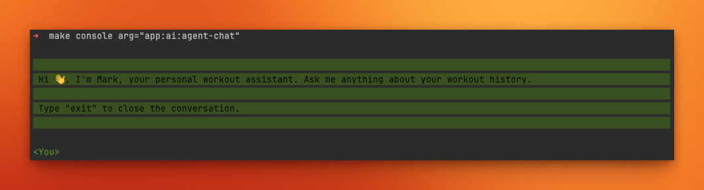

# AI integration

To start using the AI features in **Statistics for Strava**, you first need to properly configure the integration.

<div class="alert warning">
Use caution when enabling this feature if your app is publicly accessible
</div>

<div class="alert important">
Statistics for Strava uses the <a href="https://docs.neuron-ai.dev">Neuron AI</a> library to interface with AI models.
Only providers supported by Neuron AI are compatible. See the full list of <a href="https://docs.neuron-ai.dev/components/ai-provider">supported providers</a>
</div>

## Cloud providers

To use a cloud-based AI provider, you will need:

* An API key
* The name of the model you want to use

Once you have this information, update your `config.yaml` file:

```yaml
integrations:
  ai:
    enabled: true
    enableUI: false
    provider: 'PROVIDER-YOU-CHOOSE'
    configuration:
      key: 'YOUR-API-KEY'
      model: 'MODEL-NAME'
```

## Locally hosted Ollama

You can also run a local model using Ollama. Start by configuring a Docker container for Ollama:

```yaml
services:
    ollama:
        image: ollama/ollama:latest
        container_name: 'statistics-for-strava-ollama'
        tty: true
        restart: unless-stopped
        volumes:
            - .:/code
            - ./ollama:/root/.ollama
        environment:
            - OLLAMA_KEEP_ALIVE=24h
            - OLLAMA_HOST=0.0.0.0
        ports:
            - '11434:11434'
        networks:
            - statistics-for-strava-network
```

<div class="alert info">
 Looking for more advanced setups? 
Check out this <a href="https://github.com/mythrantic/ollama-docker">Ollama Docker GitHub repository</a>.
</div>

Next, download the model you want to use. For example, to run `llama3.2`:

```bash
> docker compose exec ollama ollama pull llama3.2
```

Finally, configure the AI integration in your `config.yaml` file:

```yaml
integrations:
  ai:
    enabled: true
    provider: 'ollama'
    configuration:
      url: 'http://host.docker.internal:11434/api'
      model: 'MODEL-NAME'
```

<div class="alert important">
Make sure you're running the latest version of Ollama. Streaming responses with tooling has been <a href="https://ollama.com/blog/streaming-tool">added on May 28, 2025.</a>
</div>

## Your AI workout assistant

The first available AI feature is an AI-powered workout assistant named **Mark**.
Currently, Mark can only be accessed via the CLI:

```bash
> docker compose exec app bin/console app:ai:agent-chat
```

This will prompt you with a message like the following:

 