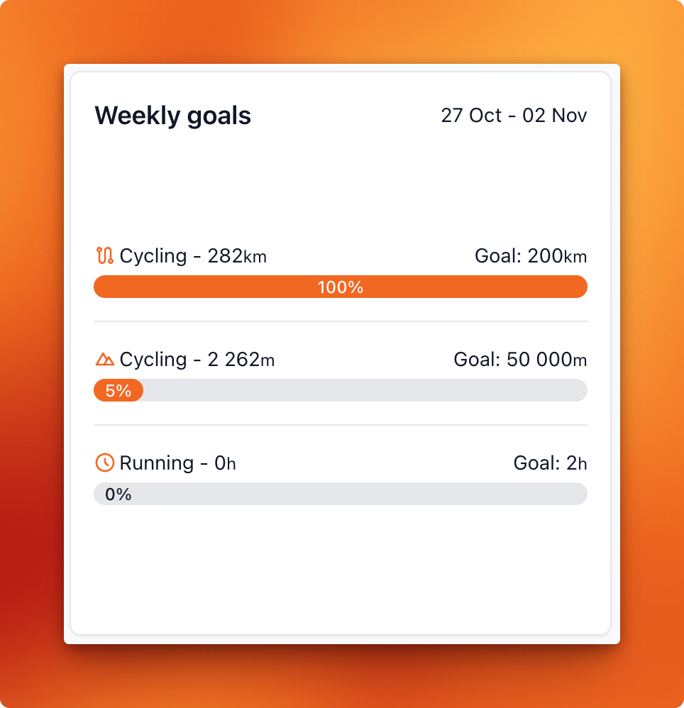
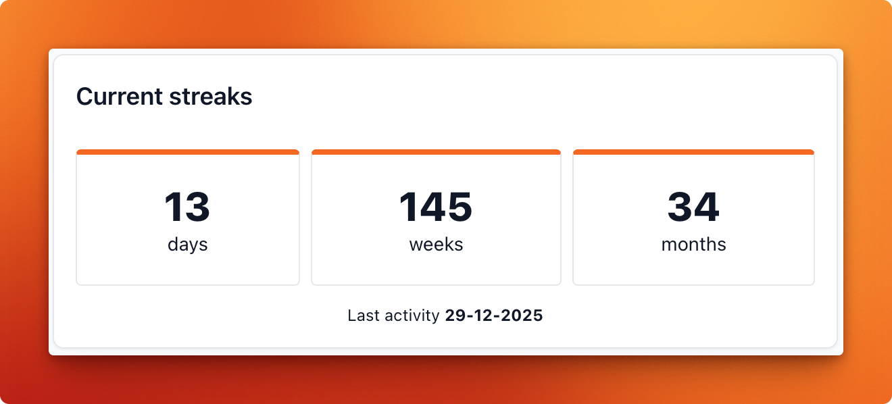
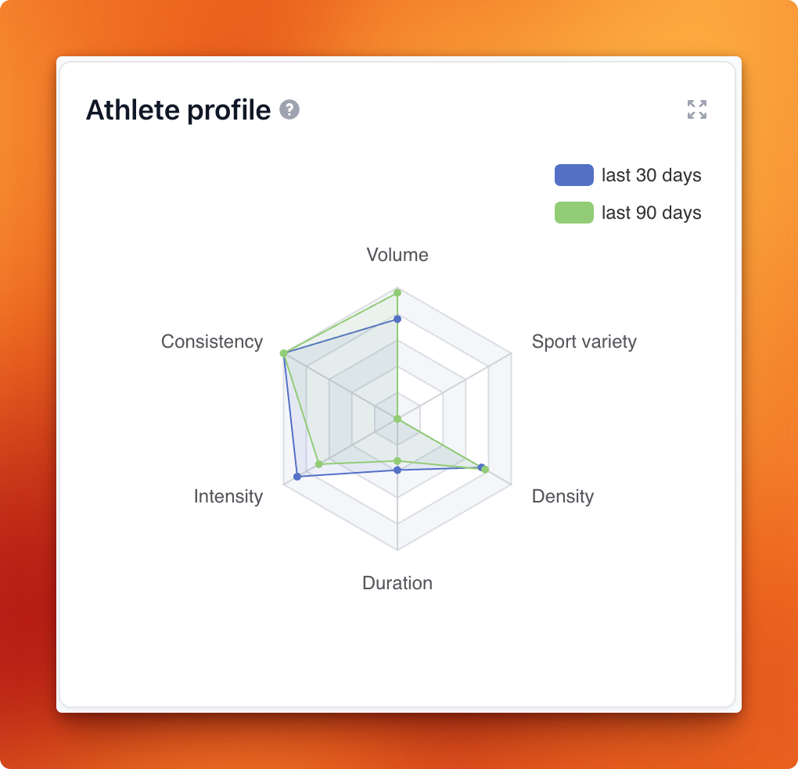
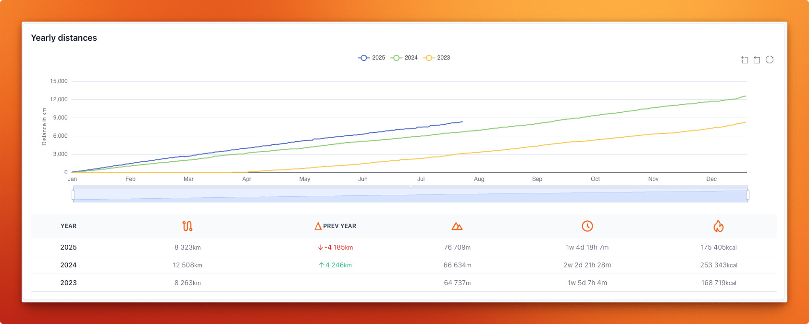
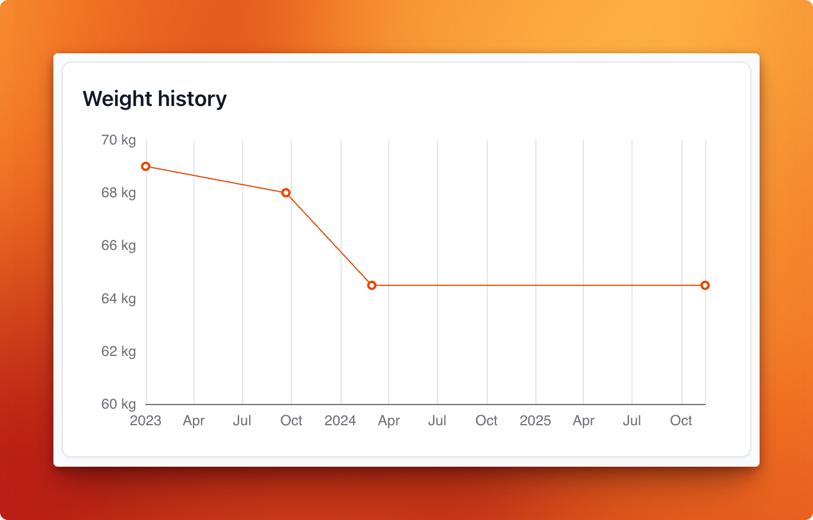

# Dashboard widgets

The dashboard consists of customizable widgets. Each widget can be individually enabled or disabled, 
assigned a specific width, and configured if it supports custom options.
Below is an example dashboard configuration — this is also the default setup, which you can use as a starting point.

```yaml
appearance:
  dashboard:
    # The width is a percentage of the available space, so 33 means the widget will take up one third of the available space.
    # The allowed values for width are 33, 50, 66, and 100.
    # The order of the widgets in the list determines their order on the dashboard.
    layout:
      - { 'widget': 'mostRecentActivities', 'width': 66, 'enabled': true, 'config': { 'numberOfActivitiesToDisplay': 5 } }
      - { 'widget': 'introText', 'width': 33, 'enabled': true }
      - { 'widget': 'trainingGoals', 'width': 33, 'enabled': false, 'config': { 'goals': [] } }
      - { 'widget': 'weeklyStats', 'width': 100, 'enabled': true, 'config': { 'metricsDisplayOrder': ['distance', 'movingTime', 'elevation'] } }
      - { 'widget': 'activityGrid', 'width': 100, 'enabled': true }
      - { 'widget': 'streaks', 'width': 33, 'enabled': true, config: { 'subtitle': null, 'sportTypesToInclude': [] } }
      - { 'widget': 'athleteProfile', 'width': 33, 'enabled': true }
      - { 'widget': 'eddington', 'width': 33, 'enabled': true }
      - { 'widget': 'peakPowerOutputs', 'width': 50, 'enabled': true }
      - { 'widget': 'heartRateZones', 'width': 50, 'enabled': true }
      - { 'widget': 'monthlyStats', 'width': 100, 'enabled': true, 'config': { 'enableLastXYearsByDefault': 10, 'metricsDisplayOrder': ['distance', 'movingTime', 'elevation'] } }
      - { 'widget': 'trainingLoad', 'width': 100, 'enabled': true }
      - { 'widget': 'weekdayStats', 'width': 50, 'enabled': true }
      - { 'widget': 'dayTimeStats', 'width': 50, 'enabled': true }
      - { 'widget': 'distanceBreakdown', 'width': 50, 'enabled': true }
      - { 'widget': 'gearStats', 'width': 50, 'enabled': true, 'config': { 'includeRetiredGear': true } }
      - { 'widget': 'yearlyStats', 'width': 100, 'enabled': true, 'config': { 'enableLastXYearsByDefault': 10, 'metricsDisplayOrder': ['distance', 'movingTime', 'elevation'] } }
      - { 'widget': 'zwiftStats', 'width': 50, 'enabled': true }
      - { 'widget': 'ftpHistory', 'width': 50, 'enabled': true }
      - { 'widget': 'challengeConsistency', 'width': 50, 'enabled': true, 'config': { 'challenges': [] } }
      - { 'widget': 'mostRecentChallengesCompleted', 'width': 50, 'enabled': true, 'config': { 'numberOfChallengesToDisplay': 5 } }
      - { 'widget': 'athleteWeightHistory', 'width': 50, 'enabled': true }
```

> [!TIP]
> **Pro tip** You can add the same widget multiple times, each with its own configuration.

## mostRecentActivities

This widget displays your most recent activities, providing a quick overview of your latest workouts.

* __numberOfActivitiesToDisplay__: the number of activities to display.

```yml
{ 'widget': 'mostRecentActivities', 'width': 66, 'enabled': true, 'config': { 'numberOfActivitiesToDisplay': 5 } }
```


## introText

This widget allows you to display a custom introduction text on your dashboard.
It contains a summary of your workout history.

```yml
{ 'widget': 'introText', 'width': 33, 'enabled': true }
```


## trainingGoals

This widget lets you define and track your weekly, monthly, yearly and lifetime goals, helping you stay motivated and monitor your progress.

> [!NOTE]
> **Note** This widget is disabled in the default dashboard layout. If you want to use this widget you need to configure a custom dashboard layout.

* __goals__: An array of goals.

```yml
{ 'widget': 'trainingGoals', 'width': 33, 'enabled': false, 'config': { 'goals': [] } }
```

Each configured goal should contain the following properties:

```yaml
# The label to be used for this challenge
label: 'Cycling'
# Enable or disable the goal. When disabled, it will no longer appear on the dashboard.
# Alternatively, you can remove the entire entry to exclude it completely.
enabled: true
# The goal type.
# Allowed values: ["distance", "elevation", "movingTime", "numberOfActivities", "calories"]
type: 'distance'
# The unit to use for measuring this goal.
# Allowed values: ["km", "m", "mi", "ft", "hour", "minute"]. This setting does not apply to types "numberOfActivities" and "calories"
unit: 'km'
# The goal.
goal: 200
# The sport types to include in this goal.
# For a complete list of supported sport types, visit: https://statistics-for-strava-docs.robiningelbrecht.be/#/configuration/main-configuration?id=supported-sport-types
sportTypesToInclude: ['Ride', 'MountainBikeRide', 'GravelRide', 'VirtualRide']
```

### Example

```yaml
'config': {          
  'goals': {
    'weekly': [
      # Cycling
      { label: 'Cycling', enabled: true, type: 'distance', unit: 'km', goal: 200,  sportTypesToInclude: ['Ride', 'MountainBikeRide', 'GravelRide', 'VirtualRide'] },
      { label: 'Cycling', enabled: true, type: 'movingTime', unit: 'hour', goal: 8,  sportTypesToInclude: ['Ride', 'MountainBikeRide', 'GravelRide', 'VirtualRide'] },
      { label: 'Cycling', enabled: true, type: 'elevation', unit: 'm', goal: 1000,  sportTypesToInclude: ['Ride', 'MountainBikeRide', 'GravelRide', 'VirtualRide'] },
      # Running
      { label: 'Running', enabled: true, type: 'movingTime', unit: 'hour', goal: 2,  sportTypesToInclude: ['Run'] },
    ],
    'monthly': [
      # Cycling
      { label: 'Cycling', enabled: true, type: 'distance', unit: 'km', goal: 1000,  sportTypesToInclude: ['Ride', 'MountainBikeRide', 'GravelRide', 'VirtualRide'] },
      { label: 'Cycling', enabled: true, type: 'movingTime', unit: 'hour', goal: 30,  sportTypesToInclude: ['Ride', 'MountainBikeRide', 'GravelRide', 'VirtualRide'] },
      { label: 'Cycling', enabled: true, type: 'elevation', unit: 'm', goal: 1500,  sportTypesToInclude: ['Ride', 'MountainBikeRide', 'GravelRide', 'VirtualRide'] },
    ],
    'yearly': [
      # Cycling
      { label: 'Cycling', enabled: true, type: 'numberOfActivities', unit: 'km', goal: 365,  sportTypesToInclude: ['Ride', 'MountainBikeRide', 'GravelRide', 'VirtualRide'] },
    ],
    'lifetime': [],
  },
}
```



## weeklyStats

This widget provides a summary of your weekly statistics per sport type, including total distance and moving time

* __metricsDisplayOrder__: The order in which the metrics are displayed in the widget. Supported metrics are 'distance', 'movingTime' and 'elevation'. All 3 metrics must be included.

```yml
{ 'widget': 'weeklyStats', 'width': 100, 'enabled': true, 'config': { 'metricsDisplayOrder': ['distance', 'movingTime', 'elevation'] } }
```


## activityGrid

This widget provides an overview your activities in a GitHub style graph.

```yml
{ 'widget': 'activityGrid', 'width': 100, 'enabled': true }
```

$

## streaks

This widget shows your current activity streaks, calculated in days, weeks, and months.

* __subtitle__: optional subtitle displayed on the widget. Useful for distinguishing between multiple instances of the same widget.
* __sportTypesToInclude__: an array of sport types to include when calculating streaks.
  Leave this empty to include all sport types.

```yml
{ 'widget': 'streaks', 'width': 33, 'enabled': true, 'config': { 'subtitle': null, 'sportTypesToInclude': [] } }
```



## athleteProfile

This widget summarizes how you train. Each axis reflects a different normalized training habit, so higher values mean stronger emphasis.

```yml
{ 'widget': 'athleteProfile', 'width': 33, 'enabled': true }
```



## eddington

This widget displays your Eddington number(s). To determine which Eddington number(s) to display,
you can configure this in the Eddington settings using `showInDashboardWidget: true|false`.

```yml
{ 'widget': 'eddington', 'width': 33, 'enabled': true }
```


## peakPowerOutputs

This widget displays your peak power outputs, allowing you to track your performance over time.

```yml
{ 'widget': 'peakPowerOutputs', 'width': 50, 'enabled': true }
```


## heartRateZones

This widget shows your heart rate zones, helping you understand your training intensity.

```yml
{ 'widget': 'heartRateZones', 'width': 50, 'enabled': true }
```


## monthlyStats

This widget displays your monthly statistics and lets you compare your performance with the same months in previous years.

* __enableLastXYearsByDefault__: enable the last X years of data dy default. Earlier years will be disabled but can be toggled.
* __metricsDisplayOrder__: The order in which the metrics are displayed in the widget. Supported metrics are 'distance', 'movingTime' and 'elevation'. All 3 metrics must be included.

```yml
{ 'widget': 'monthlyStats', 'width': 100, 'enabled': true, 'config': { 'enableLastXYearsByDefault': 10, 'metricsDisplayOrder': ['distance', 'movingTime', 'elevation'] } }
```


## trainingLoad

This widget displays your training load, helping you monitor your training stress and recovery.

```yml
{ 'widget': 'trainingLoad', 'width': 100, 'enabled': true }
```


## weekdayStats

This widget provides a breakdown of your activities by weekday, allowing you to see your training patterns throughout the week.

```yml
{ 'widget': 'weekdayStats', 'width': 50, 'enabled': true }
```


## dayTimeStats

This widget shows a breakdown of your activities by time of day, helping you understand when you are most active.

```yml
{ 'widget': 'dayTimeStats', 'width': 50, 'enabled': true }
```


## distanceBreakdown

This widget provides a breakdown of your activities by distance and activity type, allowing you to see how your training distances vary.

```yml
{ 'widget': 'distanceBreakdown', 'width': 100, 'enabled': true }
```


## gearStats

This widget displays your hours spent per gear.

* __includeRetiredGear__: flag indicating if the widget needs to include retired gear.

```yml
{ 'widget': 'gearStats', 'width': 50, 'enabled': true, 'config': { 'includeRetiredGear': true } }
```


## yearlyStats

This widget shows your yearly stats per activity type, allowing you to track your long-term training progress.

* __enableLastXYearsByDefault__: enable the last X years of data dy default. Earlier years will be disabled but can be toggled.
* __metricsDisplayOrder__: The order in which the metrics are displayed in the widget. Supported metrics are 'distance', 'movingTime' and 'elevation'. All 3 metrics must be included.

```yml
{ 'widget': 'yearlyStats', 'width': 100, 'enabled': true, 'config': { 'enableLastXYearsByDefault': 10, 'metricsDisplayOrder': ['distance', 'movingTime', 'elevation'] } }
```



## zwiftStats

This widget displays detailed stats for your Zwift activities.

```yml
{ 'widget': 'zwiftStats', 'width': 50, 'enabled': true }
```


## ftpHistory

This widget shows your Functional Threshold Power (FTP) history, allowing you to track your cycling performance over time.

```yml
{ 'widget': 'ftpHistory', 'width': 50, 'enabled': true }
```


## challengeConsistency

This widget displays your consistency in completing challenges, helping you stay motivated and track your progress.
The app uses sensible defaults for the challenges. Leave this setting unchanged to use them.

* __challenges__: An array of challenges.

```yml
{ 'widget': 'challengeConsistency', 'width': 50, 'enabled': true, 'config': { 'challenges': [] } }
```

Each configured challenge should contain the following properties:

```yaml
# The label to be used for this challenge
label: 'Ride a total of 200km'
# Enable or disable the challenge. When disabled, it will no longer appear on the dashboard.
# Alternatively, you can remove the entire entry to exclude it completely.
enabled: true
# The challenge type.
# Allowed values: ["distance", "distanceInOneActivity", "elevation", "elevationInOneActivity", "movingTime", "numberOfActivities", "calories"]
type: 'distance'
# The unit to use for measuring this challenge. This setting does not apply to types "numberOfActivities" and "calories"
# Allowed values: ["km", "m", "mi", "ft", "hour", "minute"]
unit: 'km'
# The goal of the challenge.
goal: 200
# The sport types to include in this challenge.
# For a complete list of supported sport types, visit: https://statistics-for-strava-docs.robiningelbrecht.be/#/configuration/main-configuration?id=supported-sport-types
sportTypesToInclude: ['Ride', 'MountainBikeRide', 'GravelRide', 'VirtualRide']
```

### The defaults

```yaml
'config': {
  'challenges': [
    # Cycling
    { label: 'Ride a total of 200km',  enabled: true, type: 'distance', unit: 'km', goal: 200,  sportTypesToInclude: ['Ride', 'MountainBikeRide', 'GravelRide', 'VirtualRide'] },
    { label: 'Ride a total of 600km',  enabled: true, type: 'distance', unit: 'km', goal: 600,  sportTypesToInclude: ['Ride', 'MountainBikeRide', 'GravelRide', 'VirtualRide'] },
    { label: 'Ride a total of 1250km', enabled: true, type: 'distance', unit: 'km', goal: 1250, sportTypesToInclude: ['Ride', 'MountainBikeRide', 'GravelRide', 'VirtualRide'] },
    { label: 'Complete a 100km ride',  enabled: true, type: 'distanceInOneActivity', unit: 'km', goal: 100, sportTypesToInclude: ['Ride', 'MountainBikeRide', 'GravelRide', 'VirtualRide'] },
    { label: 'Climb a total of 7500m', enabled: true, type: 'elevation', unit: 'm', goal: 7500, sportTypesToInclude: ['Ride', 'MountainBikeRide', 'GravelRide', 'VirtualRide'] },
    # Running
    { label: 'Complete a 5 km run',    enabled: true, type: 'distanceInOneActivity', unit: 'km', goal: 5,   sportTypesToInclude: ['Run', 'TrailRun', 'VirtualRun'] },
    { label: 'Complete a 10 km run',   enabled: true, type: 'distanceInOneActivity', unit: 'km', goal: 10,  sportTypesToInclude: ['Run', 'TrailRun', 'VirtualRun'] },
    { label: 'Complete a half marathon run', enabled: true, type: 'distanceInOneActivity', unit: 'km', goal: 21.1, sportTypesToInclude: ['Run', 'TrailRun', 'VirtualRun'] },
    { label: 'Run a total of 100km',   enabled: true, type: 'distance', unit: 'km', goal: 100, sportTypesToInclude: ['Run', 'TrailRun', 'VirtualRun'] },
    { label: 'Climb a total of 2000m', enabled: true, type: 'elevation', unit: 'm', goal: 2000, sportTypesToInclude: ['Run', 'TrailRun', 'VirtualRun'] }
  ]
}
```


## mostRecentChallengesCompleted

This widget displays your most recent challenges.

* __numberOfChallengesToDisplay__: the number of challenges to display.

```yml
{ 'widget': 'mostRecentChallengesCompleted', 'width': 50, 'enabled': true, 'config': { 'numberOfChallengesToDisplay': 5 } }
```


## athleteWeightHistory

This widget shows your weight history.

```yml
{ 'widget': 'athleteWeightHistory', 'width': 50, 'enabled': true }
```


