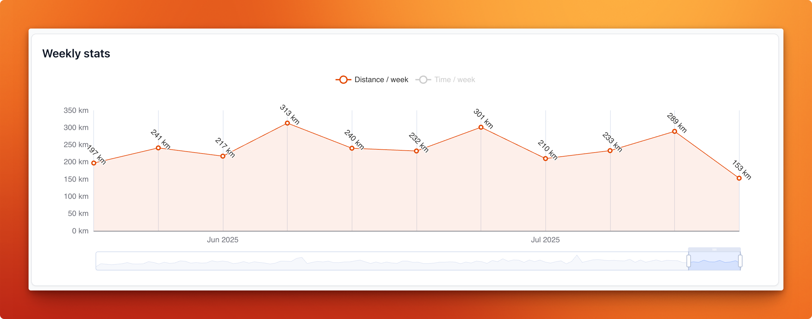

# Dashboard widgets

The dashboard consists of customizable widgets. Each widget can be individually enabled or disabled, 
assigned a specific width, and configured if it supports custom options.
Below is an example dashboard configuration — this is also the default setup, which you can use as a starting point.

```yaml
appearance:
  dashboard:
    # The width is a percentage of the available space, so 33 means the widget will take up one third of the available space.
    # The allowed values for width are 33, 50, 66, and 100.
    # The order of the widgets in the list determines their order on the dashboard.
    layout:
      - { 'widget': 'mostRecentActivities', 'width': 66, 'enabled': true, 'config': { 'numberOfActivitiesToDisplay': 5 } }
      - { 'widget': 'introText', 'width': 33, 'enabled': true }
      - { 'widget': 'weeklyStats', 'width': 100, 'enabled': true }
      - { 'widget': 'peakPowerOutputs', 'width': 50, 'enabled': true }
      - { 'widget': 'heartRateZones', 'width': 50, 'enabled': true }
      - { 'widget': 'activityGrid', 'width': 100, 'enabled': true }
      - { 'widget': 'monthlyStats', 'width': 100, 'enabled': true, 'config': { 'context': 'distance', enableLastXYearsByDefault: 10 } }
      - { 'widget': 'trainingLoad', 'width': 100, 'enabled': true }
      - { 'widget': 'weekdayStats', 'width': 50, 'enabled': true }
      - { 'widget': 'dayTimeStats', 'width': 50, 'enabled': true }
      - { 'widget': 'distanceBreakdown', 'width': 100, 'enabled': true }
      - { 'widget': 'yearlyDistances', 'width': 100, 'enabled': true }
      - { 'widget': 'zwiftStats', 'width': 50, 'enabled': true }
      - { 'widget': 'gearStats', 'width': 50, 'enabled': true, 'config': { 'includeRetiredGear': true } }
      - { 'widget': 'eddington', 'width': 50, 'enabled': true }
      - { 'widget': 'challengeConsistency', 'width': 50, 'enabled': true }
      - { 'widget': 'mostRecentChallengesCompleted', 'width': 50, 'enabled': true, 'config': { 'numberOfChallengesToDisplay': 5 } }
      - { 'widget': 'ftpHistory', 'width': 50, 'enabled': true }
```

## mostRecentActivities

This widget displays your most recent activities, providing a quick overview of your latest workouts.

* __numberOfActivitiesToDisplay__: the number of activities to display.

```yml
{ 'widget': 'mostRecentActivities', 'width': 66, 'enabled': true, 'config': { 'numberOfActivitiesToDisplay': 5 } }
```


## introText

This widget allows you to display a custom introduction text on your dashboard.
It contains a summary of your workout history.

```yml
{ 'widget': 'introText', 'width': 33, 'enabled': true }
```


## weeklyStats

This widget provides a summary of your weekly statistics per sport type, including total distance and moving time

```yml
{ 'widget': 'weeklyStats', 'width': 100, 'enabled': true }
```



## peakPowerOutputs

This widget displays your peak power outputs, allowing you to track your performance over time.

```yml
{ 'widget': 'peakPowerOutputs', 'width': 50, 'enabled': true }
```


## heartRateZones

This widget shows your heart rate zones, helping you understand your training intensity.

```yml
{ 'widget': 'heartRateZones', 'width': 50, 'enabled': true }
```


## activityGrid

This widget provides an overview your activities in a GitHub style graph.

```yml
{ 'widget': 'activityGrid', 'width': 100, 'enabled': true }
```

$

## monthlyStats

This widget displays your monthly statistics and lets you compare your performance with the same months in previous years.

* __context__: The context for the statistics, allowed values are `distance`, `movingTime` and `elevation`
* __enableLastXYearsByDefault__: enable the last X years of data dy default. Earlier years will be disabled but can be toggled.

```yml
{ 'widget': 'monthlyStats', 'width': 100, 'enabled': true, 'config': { 'context': 'distance', enableLastXYearsByDefault: 10 } }
```


<div class="alert info">
You can add this widget multiple times each with a different configuration.
</div>

## trainingLoad

This widget displays your training load, helping you monitor your training stress and recovery.

```yml
{ 'widget': 'trainingLoad', 'width': 100, 'enabled': true }
```


## weekdayStats

This widget provides a breakdown of your activities by weekday, allowing you to see your training patterns throughout the week.

```yml
{ 'widget': 'weekdayStats', 'width': 50, 'enabled': true }
```


## dayTimeStats

This widget shows a breakdown of your activities by time of day, helping you understand when you are most active.

```yml
{ 'widget': 'dayTimeStats', 'width': 50, 'enabled': true }
```


## distanceBreakdown

This widget provides a breakdown of your activities by distance and activity type, allowing you to see how your training distances vary.

```yml
{ 'widget': 'distanceBreakdown', 'width': 100, 'enabled': true }
```


## yearlyDistances

This widget shows your yearly distances per activity type, allowing you to track your long-term training progress.

* __enableLastXYearsByDefault__: enable the last X years of data dy default. Earlier years will be disabled but can be toggled.

```yml
{ 'widget': 'yearlyDistances', 'width': 100, 'enabled': true, 'config': { enableLastXYearsByDefault: 10 } }
```


## zwiftStats

This widget displays detailed stats for your Zwift activities.

```yml
{ 'widget': 'zwiftStats', 'width': 50, 'enabled': true }
```


## gearStats

This widget displays your hours spent per gear.

* __includeRetiredGear__: flag indicating if the widget needs to include retired gear.

```yml
{ 'widget': 'gearStats', 'width': 50, 'enabled': true, 'config': { 'includeRetiredGear': true } }
```


## eddington

This widget displays your Eddington number(s). To determine which Eddington number(s) to display,
you can configure this in the Eddington settings using `showInDashboardWidget: true|false`.

```yml
{ 'widget': 'eddington', 'width': 50, 'enabled': true }
```


## challengeConsistency

This widget displays your consistency in completing challenges, helping you stay motivated and track your progress.

```yml
{ 'widget': 'challengeConsistency', 'width': 50, 'enabled': true }
```


## mostRecentChallengesCompleted

This widget displays your most recent challenges.

* __numberOfChallengesToDisplay__: the number of challenges to display.

```yml
{ 'widget': 'mostRecentChallengesCompleted', 'width': 50, 'enabled': true, 'config': { 'numberOfChallengesToDisplay': 5 } }
```


## ftpHistory

This widget shows your Functional Threshold Power (FTP) history, allowing you to track your cycling performance over time.

```yml
{ 'widget': 'ftpHistory', 'width': 50, 'enabled': true }
```


