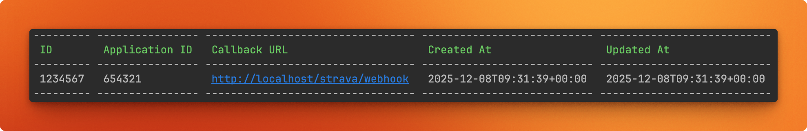

# Strava Webhooks Integration

Statistics for Strava supports Strava webhooks to automatically import and build your data when new activities are uploaded. 
This eliminates the need to manually run import commands or set up cron jobs.

When enabled, your app will receive real-time notifications from Strava whenever:

- A new activity is created
- An existing activity is updated
- An activity is deleted

These will trigger the import and build processes in the background. It may take a few minutes for all updates to fully complete.

> [!IMPORTANT]
> **Important** Your Statistics for Strava instance must be publicly accessible over HTTPS for Strava webhooks to work.

> [!IMPORTANT]
> **Important** Processing Strava webhooks requires the daemon Docker container to be configured. See the compose file [here](https://statistics-for-strava-docs.robiningelbrecht.be/#/getting-started/installation?id=docker-composeyml) for information about setting it up. 

> [!TIP]
> **Tip** If you're hosting your Statistics for Strava instance on Cloudflare, make sure to disable "Bot Fight Mode".
Cloudflare can incorrectly flag Strava’s requests as bot traffic, causing the webhook integration to fail.
This includes hosting through a Cloudflare Tunnel.

## Enable Strava webbooks

To start using webhooks, you first need to configure them in `config.yaml`.

```yaml
import:
  webhooks:
    enabled: true
    # Will be used by Strava's validation request for security.
    verifyToken: 'a-secret-token-chosen-by-you'
    # This value defines how frequently the system checks for new webhook events. It must be a number between 1 and 60.
    #
    # Lower values (closer to 1) process activities more quickly, so updates appear in SFS sooner.
    # However, multiple consecutive activity updates may trigger several imports, increasing your Strava API usage.
    # 
    # Higher values (closer to 60) slow down processing, meaning updates may take longer to appear in SFS.
    # The benefit is that multiple updates are more likely to be grouped into a single import, reducing Strava API calls.    
    checkIntervalInMinutes: 1
```

> [!IMPORTANT]
> **Important** Do not forget to restart your container after enabling the webhooks

## Configure a webhook subscription

> [!IMPORTANT]
> **Important** The following commands target the main `SFS container` not the daemon container --> note the use of the word `app` in the commands. This is the name given to the main app in the `docker-compose.yaml` file.  If you have changed the name in the `docker-compose.yaml` then you will need to update the commands to reflect. If you are using Portainer to deploy SFS, then exec into the console of the main app, not the daemon. 

Next, you need to tell Strava where it should send its notifications. 
You can do this by running the following command:

```bash
docker compose exec app bin/console app:strava:webhooks-create
```

If everything is configured correctly, you should see an output similar to:


At this point, Strava will begin sending notifications to your Statistics for Strava instance
All incoming webhooks will be logged to a separate log file located at `storage/files/logs`

## View webhook subscriptions

To see your current webhook subscription:

```bash
docker compose exec app bin/console app:strava:webhooks-view
```

This should display:



## Unsubscribe from webhooks

To delete your webhook subscription and stop receiving notifications, run

```bash
docker compose exec app bin/console app:strava:webhooks-unsubscribe <subscription-id>
```

Replace `<subscription-id>` with the ID obtained from `app:strava:webhooks-view` command.

```bash
# View subscription
docker compose exec app bin/console app:strava:webhooks-view

# Delete subscription (use the ID from above)
docker compose exec app bin/console app:strava:webhooks-unsubscribe 123456
```

## Troubleshooting tips

### Not verifiable

If you get the following error when trying to create a webhook subscription

```json
{
  "message": "Bad Request",
  "errors": [
    {
      "resource": "PushSubscription",
      "field": "callback url",
      "code": "not verifiable"
    }
  ]
}
```

be sure to:

* Check that your Statistics for Strava instance is publicly accessible over the HTTPS
* Check if there is already a subscription registered for your app. Check with `docker compose exec app bin/console app:strava:webhooks-view`
* Validate that your https://your-instance.com/strava/webhook responds with a 200 status to a validation request within 2 seconds. You can issue a request like the following to test (replace the 'test' token value with your configured verifyToken):

```bash
curl -X GET 'https://your-instance.com/strava/webhook?hub.verify_token=test&hub.challenge=15f7d1a91c1f40f8a748fd134752feb3&hub.mode=subscribe'
```

### GET to callback URL does not return 200

If you get the following error when trying to create a webhook subscription

```json
{
  "message": "Bad Request",
  "errors": [
    {
      "resource": "PushSubscription",
      "field": "callback url",
      "code": "GET to callback URL does not return 200"
    }
  ]
}
```

be sure to:

* If hosted on Cloudflare, disable Cloudflare's Bot Fight Mode (as referenced in the docs, above)
* If running authentication middlware (Authelia, etc.), ensure the URL and request parameters are configured to bypass authentication.
