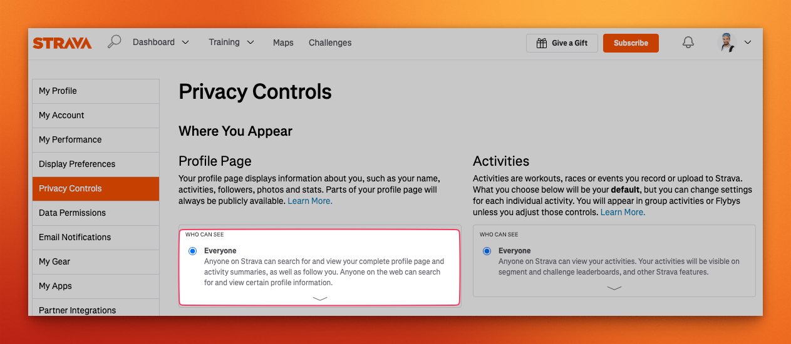
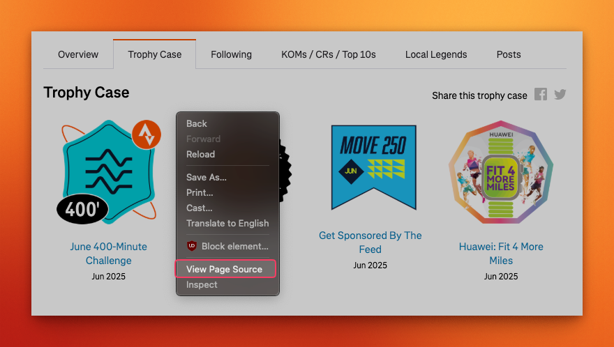

# Importing challenges and trophies

## New challenges

Only visible challenges on your public profile can be imported. Please make sure that your profile is public,
otherwise the app won't be able to import them.

## Complete history

Strava does not allow to fetch a complete history of your completed challenges and trophies.
There's a little workaround if you'd still like to import these:
* Navigate to https://www.strava.com/athletes/[YOUR_ATHLETE_ID]/trophy-case
* Open the page's source code and copy everything
* Make sure you save the source code to the file `./storage/files/strava-challenge-history.html`
* On the next import, all your challenges will be imported

> [!WARNING]
> **Warning** Make sure before you save the source code, your Strava account is set to be translated in English.
The app can only handle this export in **English** for now.
