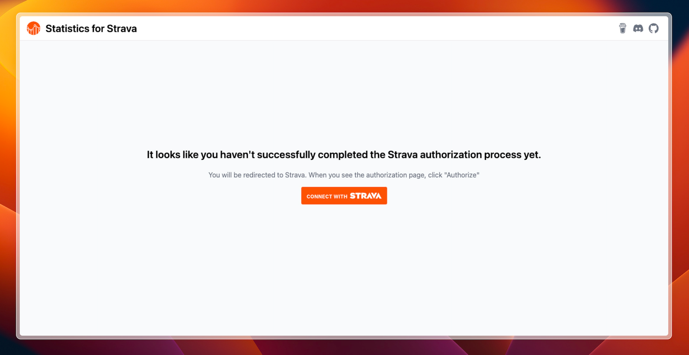

# Installation

<div class="alert info">
    To run this application, you'll need <a href="https://docs.docker.com/engine/install/">Docker</a> with <a href="https://docs.docker.com/compose/install/">docker-compose</a>.
</div>

Start off by showing some :heart: and give this repo a star. Then from your command line:

```bash
# Create a new directory
> mkdir statistics-for-strava
> cd statistics-for-strava

# Create docker-compose.yml and copy the example contents into it
> touch docker-compose.yml
> nano docker-compose.yml

# Create .env and copy the example contents into it. Configure as you see fit
> touch .env
> nano .env

# Create config.yaml and copy the example contents into it. Configure as you see fit
> touch config/config.yaml
> nano config/config.yaml
```

## docker-compose.yml

```yml
services:
  app:
    image: robiningelbrecht/strava-statistics:latest
    container_name: statistics-for-strava
    restart: unless-stopped
    volumes:
      - ./config:/var/www/config/app
      - ./build:/var/www/build
      - ./storage/database:/var/www/storage/database
      - ./storage/files:/var/www/storage/files
    env_file: ./.env
    ports:
      - 8080:8080
```

## .env

<div class="alert important">
    Every time you change the .env file, you need to restart your container for the changes to take effect.
</div>

```bash
# The client id of your Strava app.
STRAVA_CLIENT_ID=YOUR_CLIENT_ID
# The client secret of your Strava app.
STRAVA_CLIENT_SECRET=YOUR_CLIENT_SECRET
# You will need to obtain this token the first time you launch the app. 
# Leave this unchanged for now until the app tells you otherwise.
# Do not use the refresh token displayed on your Strava API settings page, it will not work.
STRAVA_REFRESH_TOKEN=YOUR_REFRESH_TOKEN_OBTAINED_AFTER_AUTH_FLOW
# The schedule to periodically run the import and HTML builds. Leave empty to disable periodic imports.
# The default schedule runs once a day at 04:05. If you do not know what cron expressions are, please leave this unchanged
# Make sure you don't run the imports too much to avoid hitting the Strava API rate limit. Once a day should be enough.
IMPORT_AND_BUILD_SCHEDULE="5 4 * * *"
# Valid timezones can found under TZ Identifier column here: https://en.wikipedia.org/wiki/List_of_tz_database_time_zones#List
TZ=Etc/GMT

# The UID and GID to create/own files managed by statistics-for-strava
#PUID=
#PGID=
```

## config.yaml

[include](../configuration/config-yaml-example.md ':include')

### Running the application

To run the application run the following command:

```bash
> docker compose up
```

The docker container is now running; navigate to `http://localhost:8080/` to access the app.

## Obtaining a Strava refresh token

The first time you launch the app, you will need to obtain a `Strava refresh token`.
The app needs this token to be able to access your data and import it into your local database.

Navigate to http://localhost:8080/.
You should see this page—just follow the steps to complete the setup.



## Import and build statistics

Once you have successfully authenticated with Strava, you can import your data and build the html files,
after which you can view your statistics.

```bash
> docker compose exec app bin/console app:strava:import-data
> docker compose exec app bin/console app:strava:build-files
```

<div class="alert important">
Everytime you import data, you need to rebuild the HTML files to see the changes. 
By default the import and build commands are run periodically based on the schedule defined in your <strong>.env</strong> file.
</div>
