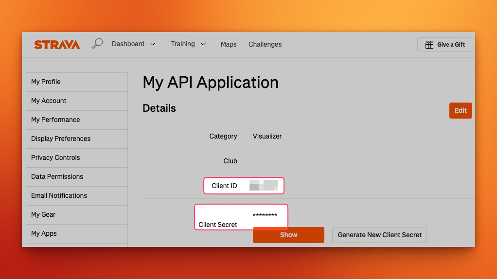

# Prerequisites

    To run this application, you'll need <a href="https://docs.docker.com/engine/install/">Docker</a> with <a href="https://docs.docker.com/compose/install/">docker-compose</a>.

Since this app is called <i>Statistics for Strava</i>, it obviously requires a Strava account.
In addition, there are a few other things you'll need to set up before you can start using the app.
Most importantly, you'll need a `Strava client ID` and `Strava client Secret`

* Navigate to your [Strava API settings page](https://www.strava.com/settings/api).
* Copy the `client ID` and `client secret`, you'll need these during the [installation](/getting-started/installation.md)
* Make sure the `Website` and `Authorization Callback Domain` are set to the url you will host your app on.
  You can configure these by clicking the __Edit__ button on the top right-hand side of the page.

 