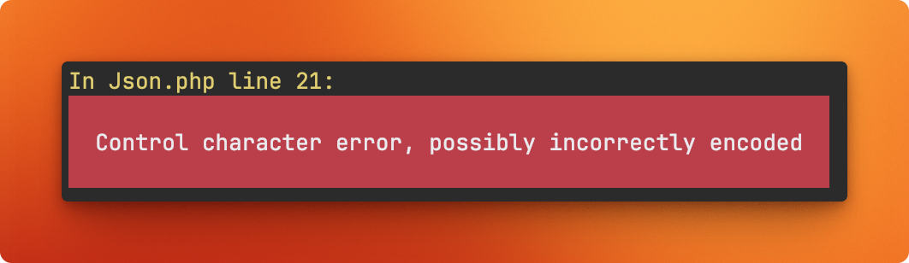

# Import/build fails with syntax error

Several users have reported unexpected "JSON Syntax" errors when importing or building the HTML files:

* https://github.com/robiningelbrecht/statistics-for-strava/issues/1621
* https://github.com/robiningelbrecht/statistics-for-strava/issues/1623
* https://github.com/robiningelbrecht/statistics-for-strava/issues/1357
* https://github.com/robiningelbrecht/statistics-for-strava/issues/1288
* https://github.com/robiningelbrecht/statistics-for-strava/issues/1180




All of these issues share the same root cause: at some point, data became corrupted. 
Unfortunately, we still don’t know exactly how or why this corruption occurs.

To resolve this, we’ve created a CLI tool that can detect corrupted data 
by identifying the activities that trigger these errors and deleting them. 
During the next import run, the deleted activities will be automatically re-imported from Strava.

Run the following command:

```bash
> docker compose exec app bin/console app:data:detect-corrupted-activities
```

This command will guide you step by step through identifying and deleting the affected activities..