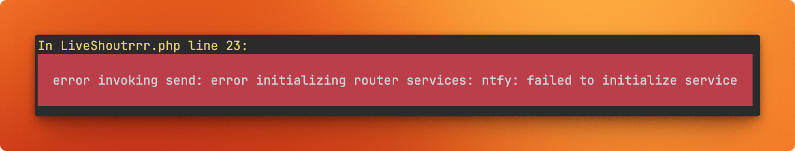

# Shoutrrr notifications

When configuring Shoutrrr services, you may encounter errors like:



This indicates that Shoutrrr attempted to send a notification to one of your configured services,
but the request failed most likely due to a misconfiguration on your end. 
This is not something Statistics for Strava can resolve, you'll need to diagnose the issue.

To debug the problem, you can manually test your configuration using:

```bash
docker compose exec app shoutrrr send -v --url="generic://https://example.com" --message="Le message" --title="Le title"
```

This command allows you to send a test notification and inspect the exact response from the service, 
making it easier to identify what’s going wrong.